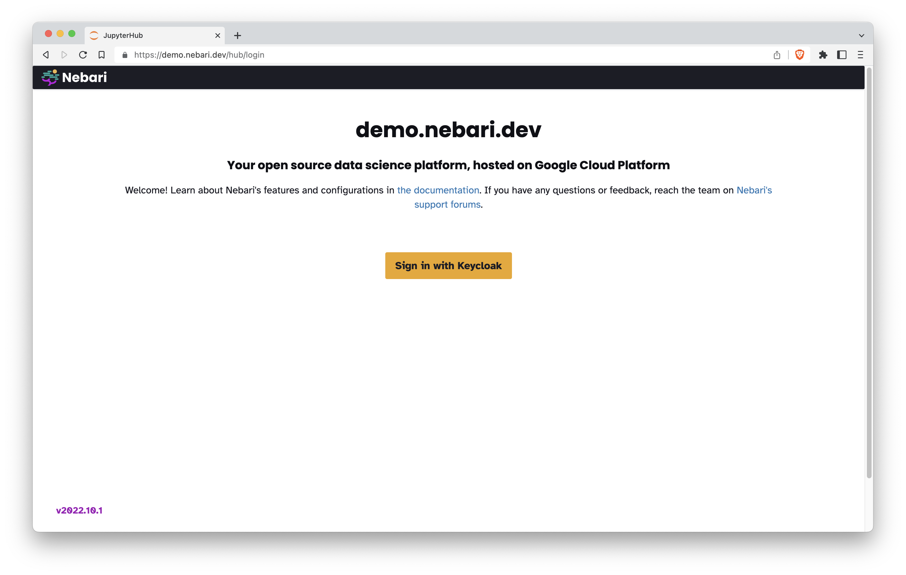
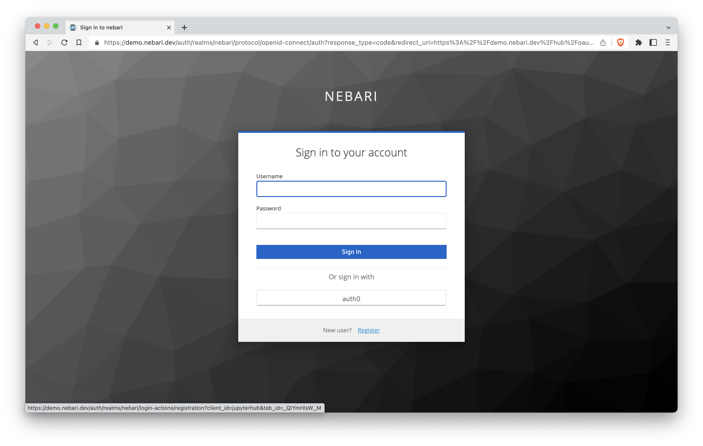
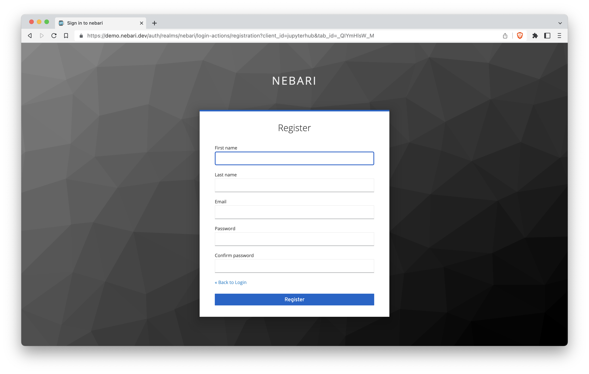
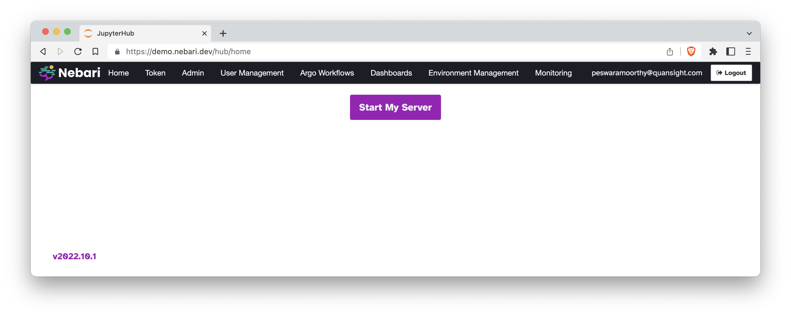
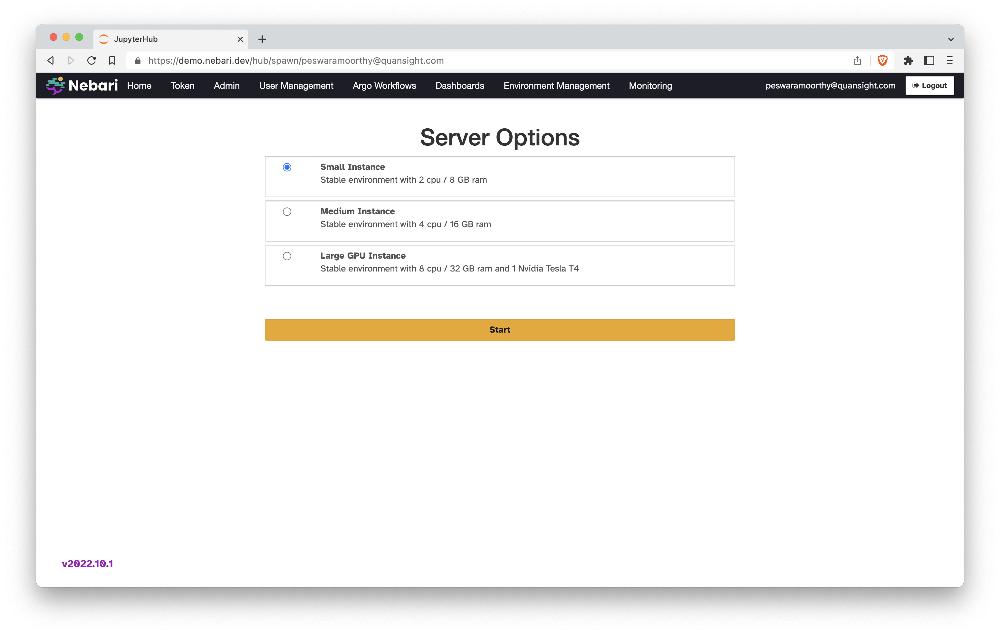
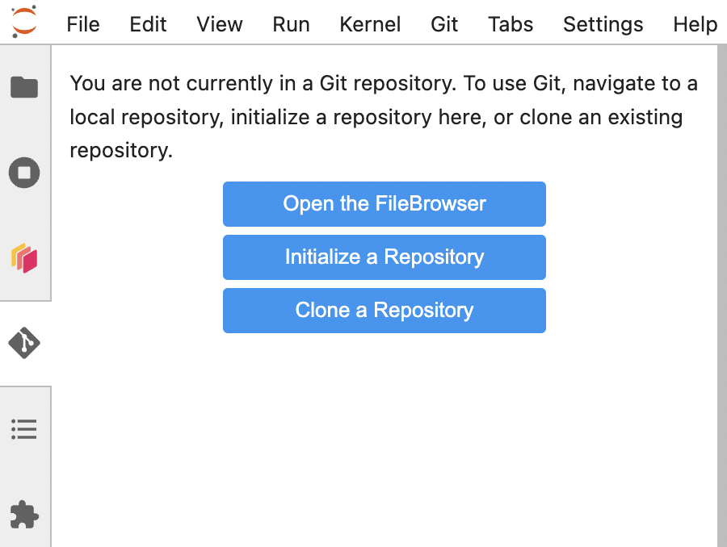

  <picture>
    <source media="(prefers-color-scheme: light)" srcset="https://raw.githubusercontent.com/nebari-dev/nebari-design/main/logo-mark/horizontal/Nebari-Logo-Horizontal-Lockup.svg">
    <source media="(prefers-color-scheme: dark)" srcset="https://raw.githubusercontent.com/nebari-dev/nebari-design/main/logo-mark/horizontal/Nebari-Logo-Horizontal-Lockup-White-text.svg">
    
  </picture>

---

# Nebari demo

> This material was presented at PyDataNYC 2022 🗽

This repo contains a walkthrough of many of Nebari's high-level features including Jupyter, Dask, conda-store, and more.

## Get started 💻

To follow along with the material covered in this presentation, navigate to [demo.nebari.dev](https://demo.nebari.dev).

### Login for the first time

To login for the first time, follow these instructions:

1. Click on the `Sign in with Keycloak` button.

2. Click `Register` at the bottom of the sign in prompt.

3. Fill out the short form to register as a new user.

> Your account will be active through the weekend for those who wish to play with the platform some more.

> The email address will serve as your username. We are not storing your email address and it will never be shared with anyone. **You can also use a fake address here**.

4. In the Hub page that opens automatically, click on the "Start My Server" button.

5. For `Server Options`, select `Small instance` and then click `Start`.

> If your server doesn't launch within 30 seconds, this means the cluster is in the process of auto-scaling to meet the new demand. Please be patient, this might take up to several minutes.

6. From here, you can clone this repo in two ways, from the Jupyter terminal or from the JupyterLab git extention.
    - Clone this repo from the Jupyter terminal: `git clone https://github.com/nebari-dev/nebari-demo`
    - Clone this repo using JupyterLab git extention

     

7. Finally, open the `00_overview.ipynb` notebook to follow along.

### Deploy your own Nebari cluster ⚙️

If you were not in attendance at the live PyDataNYC tutorial, you can deploy your own Nebari cluster and clone this repo to walk through the several of the high-level features.

To deploy your own Nebari cluster, [follow these instructions in the Nebari documentation](https://www.nebari.dev/docs/get-started/installing-nebari).

> Note that the material presented in this repo need to be run on a live Nebari deployment. Many of the features highlighed in this repo are not available in basic JupyterHub deployments.

## More resources 💬

* Read [the documentation](https://www.nebari.dev/docs) to learn more about Nebari.
* Post any questions on [our community forum](https://github.com/orgs/nebari-dev/discussions).

## Contributing 🤝

Thanks for contributing to this demo!

The complete [contributing guidelines are in our documentation](https://www.nebari.dev/docs/community/#how-to-contribute).
Here's a short reference:

1. Fork this repository on GitHub.
2. Clone your fork on the repository: `git clone https://github.com/<your-username>/nebari-demo.git`
3. Create your development environment using conda: `conda env create -f environment.yaml`
4. Create a new brnach and update the notebooks and files.
5. Open a pull request with your changes and go through the PR checklist!

> Make sure to follow the [Nebari documentation style guide](https://www.nebari.dev/docs/community/style-guide) while writing and editing content.

## Code of conduct 📜

To guarantee a welcoming and friendly community, we require all community members to follow our [Code of Conduct](https://github.com/Quansight/.github/blob/master/CODE_OF_CONDUCT.md).

## Acknowledgements 💖

Nebari is built on top of amazing open source tools like JupyterHub, Terraform, Kubernetes, conda, Dask, Jitsi, and so many more.
We thank all the tool maintainers and contributors for their hard work!
